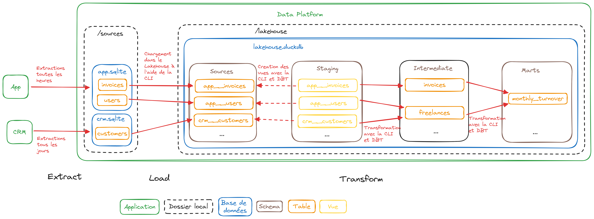

# Data Platform

## Présentation globale

Ce dépôt contient l'ensemble du code qui constitue la Data Platform. La Data Platform constitue **l'ensemble des moyens techniques mis en oeuvre pour répondre aux besoins autour de la donnée chez Jump** (reportings, extraction ad-hoc, etc.) 

La clé de voute de la Data Platform est le Lakehouse : c'est une base de donnée orientée analytique qui est composée de 4 couches :
* La couche `sources` qui contient une copie de **l'ensemble des données brutes** issue du parc applicatif utilisé chez Jump (l'application en tant que telle, le CRM, etc.)
* La couche `staging` qui est très similaire à la couche précédente mais contient **quelques étapes de nettoyage, filtrage**, etc. ;
* La couche `intermediate` qui s'appuie sur la couche précédente et contient **un modèle homogène et cohérent qui couvre l'ensemble du périmètre fonctionnel** adressé par Jump (facturation, CDI des salariés portés, etc.) ;
* Le couche `marts` qui contient **des modèles plus complexes mais à forte valeur ajoutée** nécessaires pour répondre à des besoins fonctionnels plus poussés. 

## Implémentation technique

La Data Platform s'appuie sur les technologies suivantes : 
* Le Lakehouse est **une base de données [DuckDB](https://duckdb.org/)** et chacune des couches logiques cités si-dessus est un schéma ;
* L'ensemble des transformations est réalisé **à l'aide de [DBT](https://www.getdbt.com/)** grâce à [ce projet](./dbt/) ;
* Une [CLI](./cli) en Python (nommée `data-platform`) qui permet d'orchestrer les différentes étapes d'alimentation de la Data Platform :
    * L'étape `extract` pour copier les données depuis les applications sous forme de base de données [SQLite](https://www.sqlite.org/index.html) dans le dossier `./data/sources`, 
    * L'étape `load` pour charger les données extraites dans le schéma `sources` du Lakehouse (qui va aller se trouver dans `./data/lakehouse`), 
    * L'étape `transform` pour alimenter les schémas `staging`, `intermediate` et `marts`.

L'ensemble est conteneurisé à l'aide de Docker et de [ce Dockerfile](./docker/Dockerfile).

## Utilisation

### Pré-requis
* Docker
* Make

### Commandes
* `make build` : construit l'image Docker
* `make extract` : lance l'extract des données de l'application et du CRM
* `make load` : lance l'inégration des extractions dans le schéma `source` du Lakehouse
* `make transform` : transforme les données et alimente les schémas `staging`, `intermediate` et `bronze` (à l'aide du [projet DBT](./dbt/))