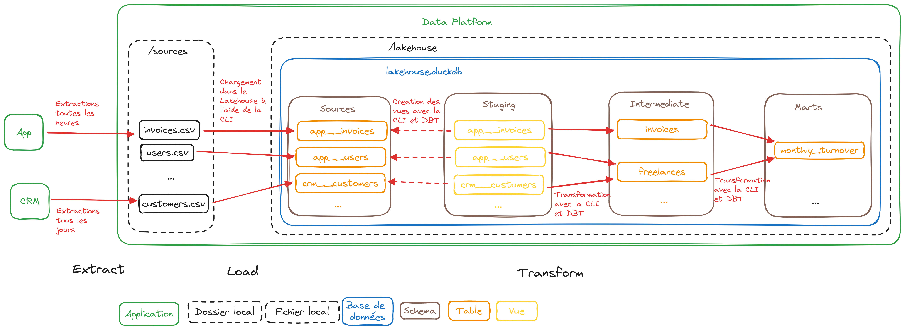

> 🇫🇷 Tu trouveras la version en français [ici](./README_en.md)! 

# Data Team / Technical Case

> 👋 Welcome! You'll find here everything you need to work on the technical case which is part of Jump's recruitement process. 

## Overview

### Data Platform
This repository contains all the code that makes up the Data Platform. The Data Platform encompasses **all the technical means implemented to meet the needs that require data processing at Jump** (reports and dashboards, ad-hoc extractions, etc.).

The cornerstone of the Data Platform is the Lakehouse: it is an analytical database composed of 4 layers:
* The Sources layer, which contains a copy of **all raw data** from the applications used at Jump (the application developed by the Backend and Frontend teams, the CRM managed by the Sales team, etc.)
* The Staging layer, which is very similar to the previous layer but contains **some cleaning and filtering steps**
* The Intermediate layer, which builds on the previous layer and contains **a homogeneous and coherent model that covers the entire functional scope** addressed by Jump (billing, permanent contracts for freelancers, etc.);
* The Marts layer, which contains **more complex models but with high added value** necessary to meet more advanced functional requirements.

> 💡 Although this repository only exists within the context of the technical test, the internal architecture we have is very similar to the one described here (even though there are more than 2 applications to integrate and the challenges are much broader).

### The Data Model

The Jump business is quite straightforward:
* A job contract at Jump is materialized by:
    * A start date,
    * An end date,
    * An entity (which can be `blue` if the freelancer subscribes to Jump Blue or `green` if they subscribe to Jump Green);
* A freelancer can have multiple job contracts, provided that the dates between two CDIs do not overlap;
* With a job contract, a freelancer can invoice a client.

## Technical Details

### Components

The Data Platform relies on the following technologies: 
* The Lakehouse is **a [DuckDB](https://duckdb.org/) database**:
    * The file is located in `./data/lakehouse/lakehouse.duckdb`, 
    * Each of the logical layers mentioned above is a schema;
* All transformations are carried out **using [DBT](https://www.getdbt.com/)** through [this project](./dbt/) ;
* A [CLI] written in Python which orchestrate the various stages that make the Data Platform work:
    * The `extract` step extracts data from the applications as CSV filesin the `./data/sources` folder, 
    * The `load` step loads the extracted date in to the `sources` schema of the Lakekhouse (which is in the `./data/lakehouse` folder), 
    * The `transform` step populate the `staging`, `intermediate` and `marts` schemas.

> ⚠️ Obviously, in the context of the technical test, we do not extract data from any application. Instead, the data is randomly generated by the CLI ([here](./cli/src/jump/data_platform/sources/app/app.py) et [here](./cli/src/jump/data_platform/sources/crm/crm.py)).

### Usage

### TL;DR...

To be able to run the commands, you will need Docker and Make.

To build the Docker image containing the Data Platform and launch all the steps to populate the Lakehouse, simply run the `make` command (without argument).

> 💥 The `make` command alone should work without any errors... If you encounter any issues, please contact us: this should not happen!

If you want more details on the available targets, you can run `make help`.

### Longer! 

Containerization is done using Docker and [this Dockerfile](./docker/Dockerfile), and all the build commands are included in [this Makefile](./Makefile).

The following targets are available:
* `make build`: builds the Docker image that includes the CLI, the DBT project, etc.
* `make extract`: extract data from the application and CRM
* `make load`: integrate extractions into the `source` schema of the Lakehouse
* `make transform`: transforms the data and populates the `staging`, `intermediate`, and `marts` schemas (using the [DBT project](./dbt/))
* `make query`: launches the DuckDB REPL to query the Lakehouse

> Feel free to explore the data by navigating through the [DBT project](./dbt/) and querying tables with `make query`.

Please note that a [GitHub Action workflow](https://github.com/Freelance-launchpad/data-team-technical-case/actions) has also been setup. Its goals are :
* Running the commands defined above
* Make available the DBT analysis exports (as CSV files) and the Lakehouse itself (as a DuckDB database)

> 💡 Be sure that all the modifications you're making don't break the workflow!

> ❓ Is everything clear? If so, find the exercises to complete [here](./exercices/positions/data-analyst_en.md)! 
